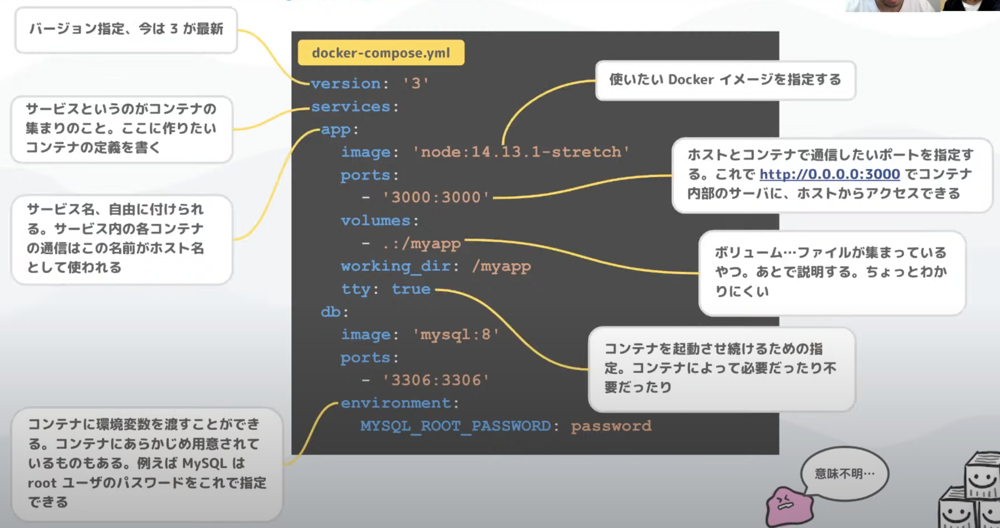

[ムーザルちゃんねるの youtube](https://www.youtube.com/watch?v=M3h_z-9DoMQ)が参考になった<br>
[youtube 内の資料](https://speakerdeck.com/mu_zaru/sakututoli-tishang-garuhuan-jing-gou-zhu-docker-compose-ru-men)

<br>

現在は docker-compose の後発として Docker のサブコマンドで`compose`オプションがある。<br>
互換性を保ち docker-compose と同じ機能が使える。
docker-compose コマンドの将来的な置き換えを目指して開発された機能のため、`compose`オプションを使用した方が良さそう？

<br>

# docker-compose とは

複数コンテナを立てる場合に、Docer だけで管理するのは「個別の起動」や「ネットワークの指定」がめんどくさい<br>
それらを docker-compose コマンド（1 コマンド）でいい感じに管理とか起動ができる。<br>
Docker とは別にインストールが必要なはず。<br>
ただ、Docker for Mac とかをインストールすると自動で入っている

<br>

docker-compose を使う理由は、Docker だけだと「アプリのコンテナ」 「DB のコンテナ」 「web サーバーのコンテナ」の 3 つのコンテナがある場合に

## **【Docker のみ】**

アプリのコンテナを立ち上げる

```bash: appコンテナ立ち上げ
$ docker run {イメージ名}
```

<br>

DB のコンテナを立ち上げる

```bash: DBコンテナ立ち上げ
$ docker run {イメージ名}
```

<br>

web サーバーのコンテナを立ち上げる

```bash: webサーバーコンテナ立ち上げ
$ docker run {イメージ名}
```

<br>
<br>

## **【docker-compose】**

docker-compose.yml があるディレクトリで以下コマンドを叩くと yml ファイル内にそれぞれに設定した内容でコンテナが立ち上がる。<br>
複数ではなく、1 つだけのコンテナの場合も docker-compose を使った方が便利らしい？

```bash: docker-composeの場合
$ docker-compose up
```

### docker-compose.yml の例



※ [上記画像の引用元](https://speakerdeck.com/mu_zaru/sakututoli-tishang-garuhuan-jing-gou-zhu-docker-compose-ru-men?slide=11)

- volumes しかり ports しかり 左がホスト（mac, windows などの自分が触ってるマシン）で:(コロン)の右側がコンテナ
- 上記画像の例では image に Docker Hub に公開されているイメージ名を指定している
- 実際のアプリ開発でアプリケーションコンテナ（Next.js, Ruby on Rails）は自前の Dockerfile でイメージを作成
- MySQL, Redis, nginx などのミドルウェアは Docker Hub に公開されている公式のイメージをそのまま使うことが多いらしい

<br>
<br>

---

## 【docker-compose でのコンテナ起動】

docker-compose.yml ファイルを作ったディレクトリで以下コマンド実行

```bash: コンテナ起動コマンド
$ docker-compose up -d
```

※ "-d"オプションはバックグラウンドでコンテナを起動してくれる<br>
（"-d"オプションがないとターミナルが起動したコンテナで占領されて$ Ctr + c で抜けるまでターミナル触れない）

<br>
<br>

---

## 【docker-compose でのコンテナに入る】

docker-compose.yml ファイルを作ったディレクトリで以下コマンド実行

```bash: コンテナに入るコマンド
$ docker-compose exec {コンテナ名} bash
```

bash を指定するとコンテナ内部の bash でコンテナ内に入ることができる。<br>
このコマンドはお決まりの呪文みたいなものなので、覚えてしまう。

※ Linux のコマンド書くとコンテナに対して Linux コマンドを実行できる
