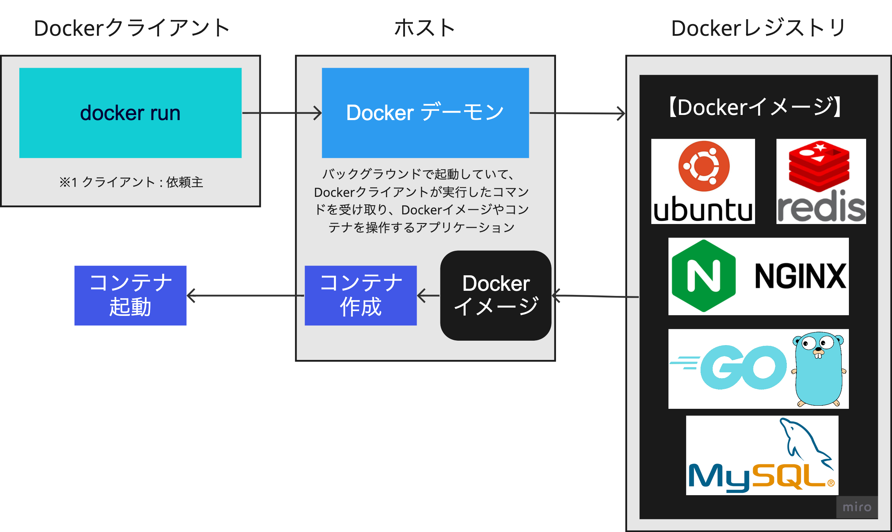

# docker とは

アプリを簡単に開発・デプロイできる仕組み。
OS などに依存せず、同じような環境を簡単に作成できる。

Docker があれば、Dockerfile を共有するだけで同じ開発環境がすぐに作れてライブラリのインストールなどもコンテナにさせることができる。 
またテスト環境も、本番環境も「OS」「ライブラリ」「アプリケーションコード」をひとまとめにしたものをそのまま各環境に入れるだけで環境構築ができるためとても楽に環境を用意できる。

 

