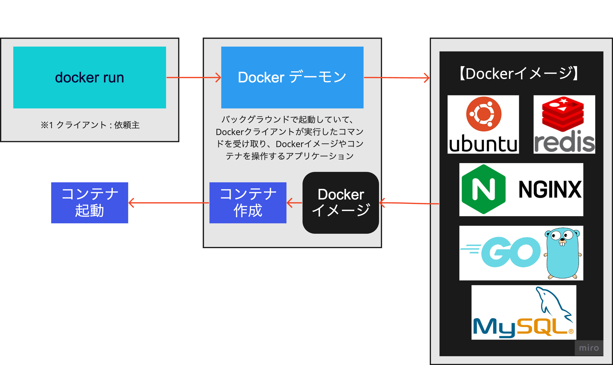

# docker とは

アプリを簡単に開発・デプロイできる仕組み。
OS などに依存せず、同じような環境を簡単に作成できる。

Docker があれば、Dockerfile を共有するだけで同じ開発環境がすぐに作れてライブラリのインストールなどもコンテナにさせることができる。<br>
またテスト環境も、本番環境も「OS」「ライブラリ」「アプリケーションコード」をひとまとめにしたものをそのまま各環境に入れるだけで環境構築ができるためとても楽に環境を用意できる。

<br>


<br>
<br>

## docker run 実行時に裏で起きていること



<br><br>

---

## 【コンテナとイメージの削除方法】

1.  コンテナ ID を確認

```shell
起動しているコンテナ

$ docker ps

停止しているコンテナ

$ docker ps -a
```

<br><br>

2.  コンテナが起動している場合は、コンテナの停止

```shell
$ docker stop ${コンテナID}
```

<br><br>

3. コンテナの削除

```shell
$ docker rm ${コンテナID}
```

<br><br>

3. イメージの削除

```shell
$ docker rmi ${イメージID}
```

<br><br>
