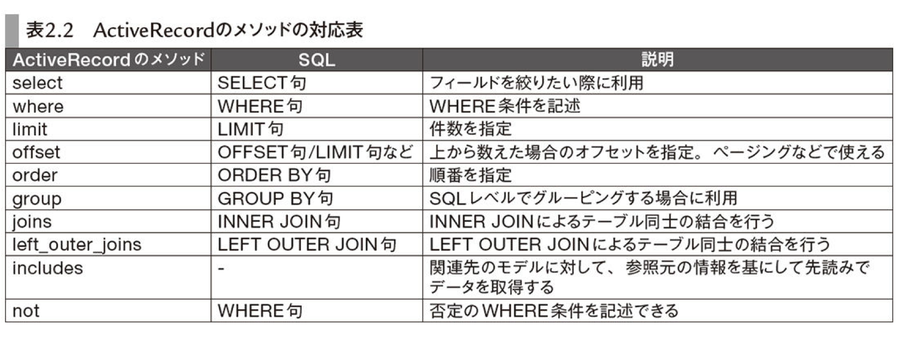

# Ruby on Rails

## **ActiveRecord**

データベースからオブジェクトを取り出すメソッド一覧

- annotate
- find
- create_with
- distinct
- eager_load
- extending
- extract_associated
- from
- group
- having
- includes
- joins
- left_outer_joins
- limit
- lock
- none
- offset
- optimizer_hints
- order
- preload
- readonly
- references
- reorder
- reselect
- regroup
- reverse_order
- select
- where

 

### 【present メソッド】

present メソッドは、オブジェクトが存在し、かつ空でない場合に true を返します。これは Rails の ActiveSupport モジュールによって提供されるメソッド。
何かしら値があれば true を返す。

- nil, false, 空の文字列（""）、空の配列（[]）、空のハッシュ（{}） に対しては false を返す
- 上記以外の値に対しては true を返す

 

ActiveRecord のメソッド一覧

