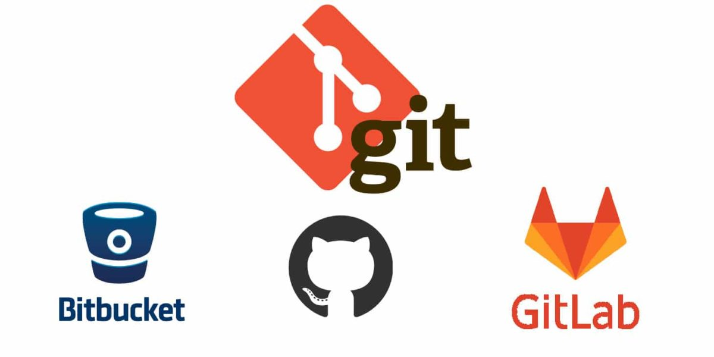
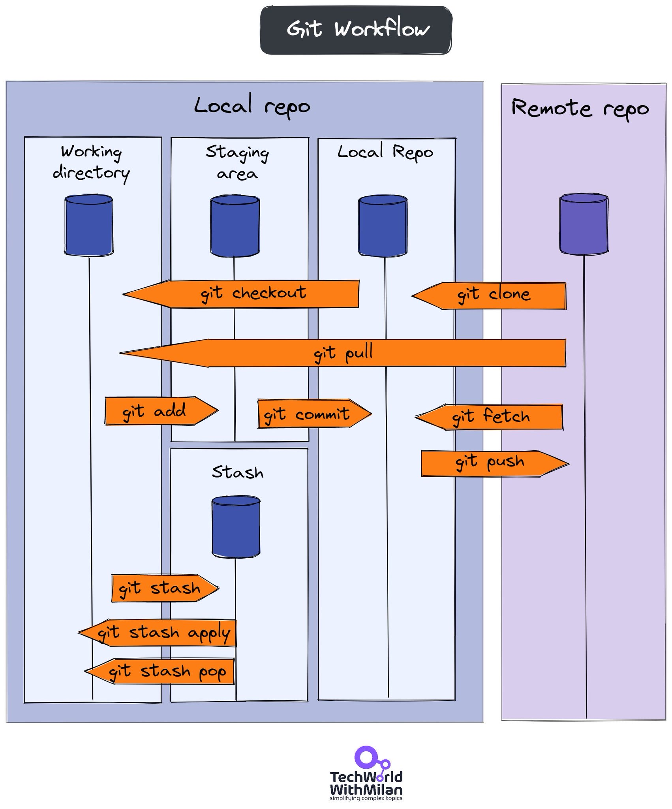
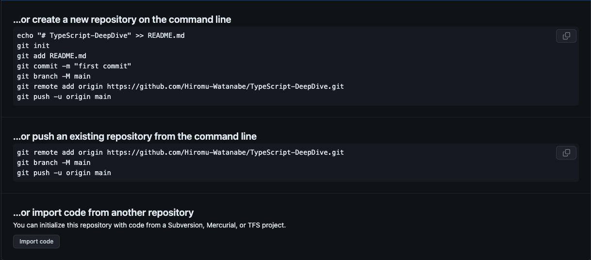

# Git について



<br />
<br />

## **<font color="#00ff00">Git の仕組み図</font>**



<br />
<br />

## **<font color="#00ff00">Git インストール</font>**

[HomeBrew](https://brew.sh/ja/)でインストール ([参照記事](https://qiita.com/suke_masa/items/4bed855628f7414293f8))

```shell
$ brew install git
```

<br />
<br />

## **<font color="#00ff00">Git config （設定情報）</font>**

[この記事](https://note.nkmk.me/git-config-setting/)が参考になった。

<br />

※ Git の設定ファイルは 3 種類
| 種類 | 対象範囲 | 場所の例 | 備考 |
| :-: | :- | :- | :- |
| system | システム全体（全ユーザーの全リポジトリ） | `etc/gitconfig` | - |
| global | 該当ユーザーの全リポジトリ | `~/.gitconfig` | ホーム直下 |
| local | 該当リポジトリ | `repository/.git/config` | リポジトリの`.git`直下 |

<br />
<br />

---

**【リポジトリごとに個別に Git のユーザーを設定する方法】**

1. 設定したいリポジトリのパスまで移動

2. 一応リポジトリの Git の設定情報を確認

```
$ git config --local -l
```

3. 設定情報を修正
   user.name の修正

```
$ git config user.name "{設定したい名前}"
```

user.email の修正

```
$ git config user.email "{設定したいメアド}"
```

<br />
<br />

---

## **<font color="#00ff00">リモート設定</font>**

現在のリモート設定を確認

```shell
$ git remote -v

# 出力
grc     codecommit::ap-northeast-1://{リポジトリ名} (fetch)
grc     codecommit::ap-northeast-1://{リポジトリ名} (push)
origin  git@github.com:{ユーザー or 組織名}/{リポジトリ名}.git (fetch)
origin  git@github.com:{ユーザー or 組織名}/{リポジトリ名}.git (push)
```

<br>

origin の URL を設定

```shell
$ git remote set-url origin [GitHubのリポジトリのURL]
```

<br>

今いるブランチ`pull`コマンド実行時のデフォルトリモートを設定

```shell
# 例)`origin/stg`をpullコマンドのデフォルトのリモートに設定したい場合
$ git branch --set-upstream-to=origin/stg stg

# 出力
Branch 'stg' set up to track remote branch 'stg' from 'origin'.
```

<br />
<br />

---

## **<font color="#00ff00">リポジトリ作成後の初っ端</font>**

**【リポジトリをそのまま clone】**

```shell
$ git clone https://github.com/${ユーザー名}/${リポジトリ名}.git
```

**【その他もろもろパターン】**



<br />
<br />

## **<font color="#00ff00">コミットメッセージについて</font>**

[この記事](https://qiita.com/itosho/items/9565c6ad2ffc24c09364)を参考にしてる。

これが正解ではないので、プロジェクトや開発しながらこうした方が良いと思ったものは取り入れて<br />
進化させていくべき。

<br />

**通常盤**

- fix：バグ修正
- hotfix：クリティカルなバグ修正
- add：新規（ファイル）機能追加
- update：機能修正（バグではない）
- change：仕様変更
- clean：整理（リファクタリング等）
- disable：無効化（コメントアウト等）
- remove：削除（ファイル）
- upgrade：バージョンアップ
- revert：変更取り消し

<br />

**ライト版**

- fix：バグ修正
- add：新規（ファイル）機能追加
- update：機能修正（バグではない）
- remove：削除（ファイル）

<br />
<br />

## **<font color="#00ff00">stash</font>**

**1. 変更を退避**

```shell: スタッシュのコマンド
$ git stash # スタッシュのメッセージを設定せずにスタッシュする
$ git stash save "message" # スタッシュのメッセージを設定してスタッシュする
$ git stash -u # 未追跡のファイルも全てスタッシュされる
$ git stash -k # `git stash --keep-index` : 追跡されているファイルをスタッシュに保存するが、ステージングエリアにある変更はそのまま保持

# .gitignoreのファイルは依然としてスタッシュに含まれない
```

コミットしていない変更がある状態で上記のコマンドを実行すると、コミットしていない変更した部分が退避される。<br />
「コミットしていない変更」とは、`git addしたもの`も`git addしていないもの`もどちらも含まれる。

<br />

**2. 退避した作業の一覧を見る**

```shell: 退避した内容の一覧を見るコマンド
$ git stash list
```

<br />

**3. pull などする**

<br />

**4. 指定した退避内容を戻す**

```shell: 退避した内容を戻すコマンド
$ git stash apply stash@{[スタッシュ番号]}
```

<br />
<br />

**5. 指定した退避内容を削除する**

```shell: 退避した内容を削除コマンド
$ git stash drop stash@{N} # N番目のスタッシュを削除
$ git stash clear # スタッシュを全削除
```

<br />
<br />

**【番外編】指定した退避内容を戻すと同時に削除する**

```shell: 指定した退避内容を戻すと同時に削除するコマンド
$ git stash pop # 最新のスタッシュを適用し、削除
$ git stash pop stash@{n} # N番目のスタッシュを適用し、削除
```

<br />
<br />

**【Tips】**

N 番目にスタッシュしたファイルの一覧を表示

```shell
$ git stash show stash@{N}
```

<br />

N 番目にスタッシュしたファイルの変更差分を表示

```shell
$ git stash show -p stash@{N}
```

<br />

N 番目にスタッシュしたファイルの変更差分を表示

```shell
$ git stash show -p stash@{N}
```

<br>

特定のファイルのみスタッシュする

```shell
git stash push -- <filepash>

# srcディレクトリのtest.pyだけをスタッシュしたい
git stash push -- src/test.py
```

<br />
<br />

## **<font color="#00ff00">ブランチ</font>**

**1. ブランチの一覧を表示**

ローカルブランチの一覧

```shell
$ git branch
```

すべてのブランチ（リモートにある他の人が切ったブランチも含む）

```shell
$ git branch -a

# リモートで削除されたはずのブランチがローカルに出てくる場合は
# ローカルにリモート追跡ブランチが残ってしまっているため以下どちらかのコマンド実行
$ git fetch --prune
# or
$ git remote prune origin
```

**2. ブランチの追加**

```shell
$ git branch {追加したいブランチ名}
```

**3. ブランチの切り替え**

```shell
# ブランチの一覧を確認
$ git branch
## 出力 ##
# * develop
#   stg
#   prod
#   main

$ git checkout stg
## 出力 ##
#   develop
# * stg
#   prod
#   main
```

**3.5. ブランチの作成 & 切り替え**

```shell
git checkout -b {ブランチ名}
```

**4. ブランチの削除**

```shell
$ git branch -d {削除したいブランチ名}
```

<br />
<br />

## **<font color="#00ff00">コミットに関するコマンド</font>**

**コミット取り消し**

```shell
$ git reset [打ち消したいコミットID]

# 【resetオプション】

# 直前のコミット操作を取り消す ※ 劇薬のため注意！
git reset --hard HEAD^
# コミット前のローカルファイル(新規ファイル以外)が全部消えてしまう
# 全部消えた例の記事 : https://zenn.dev/fukutan/articles/a688699f120071

# --softオプション
$ git reset --soft
# commitのみ取り消し（HEADの位置のみ修正）
# 「コミットをする直前」の状態に戻る
# 作業ディレクトリとステージングエリアはそのまま
# 例）まとめてコミットしたかったのに1つしかコミットしていなかったとき
# 例）まだ作業中なのにコミットしてしまったとき

# -- mixedオプション
$ git reset --mixed
# commitとaddの取り消し（HEADの位置・インデックスが修正）
# HEADと一緒にステージが巻き戻る
# 作業ディレクトリのファイルは消えない
# 例）git addでステージしたけど、やっぱり戻したいとき

# -- hardオプション
$ git reset --hard
# 全部を取り消し（HEADの位置・インデックス・ワーキングツリーが修正）
# もっとも強力なオプション
# 例）ステージングエリアにも作業ディレクトリにも残したくないといった
```

### 【git push したコミットを取り消す】

参照記事: https://www-creators.com/archives/2020#_push

解決の方針は大きく 2 つ

1.  過ちを隠す

         pushしたコミットを取り消し、リモートからも削除して無かったことにする

2.  過ちを認める

         間違いコミットを打ち消す「revertコミット」を作成して、追加pushする

<br>

#### 1 の方法 : push した コミットを削除する方法

---

ローカル履歴から変更を取り消して、履歴を push しなおす。
ローカルでコミットを強制的に書き換える。
直前のコミットを取り消すだけなら HEAD^を指定して、ブランチの先頭を一つ昔の戻す。

1. コミットを取り消す

```shell
# 直前のコミットを取り消す
git reset --hard HEAD^

# 指定したコミットまで戻したい
git reset --hard [commit_id]
```

2. リモートに push

```shell
# 強制的にpush
git push -f origin main
# そのままpushしようとするとリモートにある以前のコミットとコンフリクトするため`-f`オプションが必要
```

git push の引数の使用はやや複雑なため、参考記事を貼り付けとく

[git push を強制するオプションと、注意事項まとめ。](https://www-creators.com/archives/1472)

ーーーーーーーーーーーーーー

**※ 注意ポイント<br>**

この修正の間に、push したリモートの `main` ブランチを誰も触っていない前提であること。<br>
間違った master ブランチの先頭コミットから別の開発を開始してしまったチームメンバーがいたら、きっと push 時に怒られる。<br>
ばれないように、素早く、素早く行う。。

修正するのが、 main などの共有された統合用のブランチではなく、トピックブランチだったり、一人だけで開発しているときはけっこうバシバシ使って OK。<br>
使い方を間違えると危ないけど、パワフルなやり方、くらいに捉えてる。

ーーーーーーーーーーーーーー

<br><br>

#### 2 の方法 : `git revert` で取り消しコミットを作成する

---

こっちは比較的安全な取り消し方法？
変更を打ち消す`git revert` コマンドを使います。下の２つは同義で、HEAD での変更を打ち消すコミットを作成し、その前の HEAD^と同じ状態を作ります。。

1. 打ち消しコミットを作成

```shell
# 直前のコミットを打ち消すコミット
git revert
git revert HEAD


# 例えば、複数のコミットならこのようにも書けます。
# 最新をふくめ、過去4つ分のコミットを打ち消す
git revert HEAD~3
```

2. リモートに push

```shell
git push origin main
```

revert コマンドによって、過去のコミットをちょうど打ち消す、新しいコミットが追加される。<br>
あとは、push するだけ。新しいコミットなので、コンフリクトはしない、-f オプションは不要。

ーーーーーーーーーーーーーー

**※ ポイント<br>**

この revert は過去の歴史を書き換えない、比較的安全な取り消し方法だが、どうしても不用意なコミットが増えて、履歴が見にくくなってしまうのが難点。<br>
一人だけでの開発においては `reset` で取り消してしまったほうが分かりやすいので、`revert` はあまり使わないかも。

ーーーーーーーーーーーーーー

参考記事:

[git commit の取り消し&#038;やり直し、完全攻略。](https://www-creators.com/archives/1116)

[git revert でマージコミットを取り消す方法と、注意点。](https://www-creators.com/archives/2111)

[git push コマンドの使い方と、主要オプションまとめ](https://www-creators.com/archives/1472)

[git revert の公式ドキュメント](https://git-scm.com/docs/git-revert)

<br>

### 【空のコミットをするための小技】

CI のテストだけやりたくて origin に push したいけど、特に変更することないみたいな時

```shell
$ git commit --allow-empty -m 'empty'
```

<br />
<br />

## **<font color="#00ff00">マージに関するコマンド</font>**

マージの実行（main ブランチに dev ブランチをマージ）

```shell
# マージを実行したいブランチに移動
$ git checkout main

# mainブランチにdevブランチをマージ実行
$ git merge dev
```

マージ操作の中止

```shell
$ git merge --abort
```

<br><br>

## **<font color="#00ff00">履歴の表示コマンド</font>**

git の履歴を表示するコマンド

```shell
# 単純な履歴を表示
$ git log

# 変更ファイルリスト一覧も表示
$ git log --name-status

# リモートの履歴を表示
$ git log --oneline origin/stg
$ git log --oneline origin/stg -5 # リモートの履歴を5件表示
```

<br><br>

## **<font color="#00ff00">ローカルとリモートブランチの差分を見る方法</font>**

[引用記事](https://salumarine.com/how-to-compare-a-local-git-branch-with-its-remote-branch/)

前提条件

```shell
# まずはgit fetchを実行してリモートの変更を取得しておく
$ git fetch
```

<br>

差分を表示

```shell
$ git diff [ローカルブランチ] [リモート]/[リモートブランチ]

# developブランチの例
$ git diff develop origin/develop

# 空白文字の違いを無視するには-wオプションを付与
# これで何も表示されなければ、空白文字以外の違いはないことが確認できる
$ git diff -w develop origin/develop
```

<br>

`git push`する前に確認する癖をつけとくと良いかも

```shell
$ git fetch
$ git diff main origin/main
```
