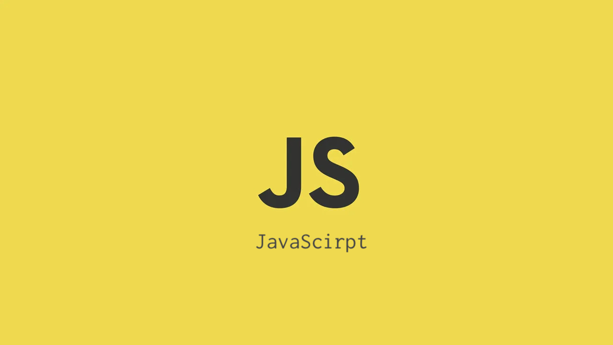

# JavaScript


JavaScriptは主にウェブブラウザの中で動くプログラミング言語。（Node.jsを除く）

主に使われている用途は以下の 2 つの認識。

- DOM 操作
- データのやり取り（サーバーと通信など）

<br />
<br />

---

<br />

## **<font color="#00ff00">丸め誤差</font>**

小数点以下の計算を行った際に発生する誤差のこと。

`0.3 - 0.2 = 0.1` になるはずだが、`0.09999999999999998` になったり誤差が出る

<br />

**【誤差が起きる原因】**

Javascript では小数点以下の計算には浮動小数点が使われる[（IEEE754:浮動小数点数算術標準）](https://ja.wikipedia.org/wiki/IEEE_754)

その際に 2 進数で表せない数の場合は近似値で表されることになり、誤差が生じる。
この近似値は実際の数値と比べて多少誤差がある上に、近似値同士で計算された場合に誤差が顕著に現れる。

その結果先ほどの例のように、`0.3 - 0.2 -> 0.09999999999999998`となり、<br />
期待値の`0.1`から`0.00000000000000002`の誤差が生まれる。

また[IEEE754](https://ja.wikipedia.org/wiki/IEEE_754)はさまざまなシステムが採用しており、JavaScript に限った話ではないため、言語によって注意が必要。

<br />

Number 型は`小数点約17桁`まで精度を保証している

<br />

**【丸め誤差の対応】**

- 小数点を整数に直して計算する
- ライブラリを使用する

<br />
<br />

---

### 組み込み関数

## **<font color="#00ff00">Array.prototype.sort()</font>**

※ a を基準に考える
| sort((a, b) => {処理結果})の戻り値 | ソート順 |
| :-: | :- |
| a > 0 | a を b の後に並べる |
| a < 0 | a を b の前に並べる |
| a === 0 | a と b の元の順序を維持 |

<br><br>

例) 数値と日付のソート例<br>
[mdn web docs](https://developer.mozilla.org/ja/docs/Web/JavaScript/Reference/Global_Objects/Array/sort)で実際に動かせる

```js
/* 単純な数値 */
const array1 = [0, 1, 2, 10, 1000]
console.log(array1.sort(a, b) => a - b) // 昇順
console.log(array1.sort(a, b) => b - a) // 降順


/* 日付 */
import dayjs from 'dayjs' // ライブラリのdayjsを使用した場合
const array2 = ['2023-08-04T12:00:00.000+09:00', '2023-08-05T12:00:00.000+09:00', '2023-08-06T12:00:00.000+09:00']
// 昇順
console.log(array1.sort(a, b) =>
  dayjs(a?.orderCreatedDatetime ?? 0).valueOf() -
  dayjs(b?.orderCreatedDatetime ?? 0).valueOf())
// 降順
console.log(array1.sort(a, b) =>
  dayjs(b?.orderCreatedDatetime ?? 0).valueOf() -
  dayjs(a?.orderCreatedDatetime ?? 0).valueOf())
```
