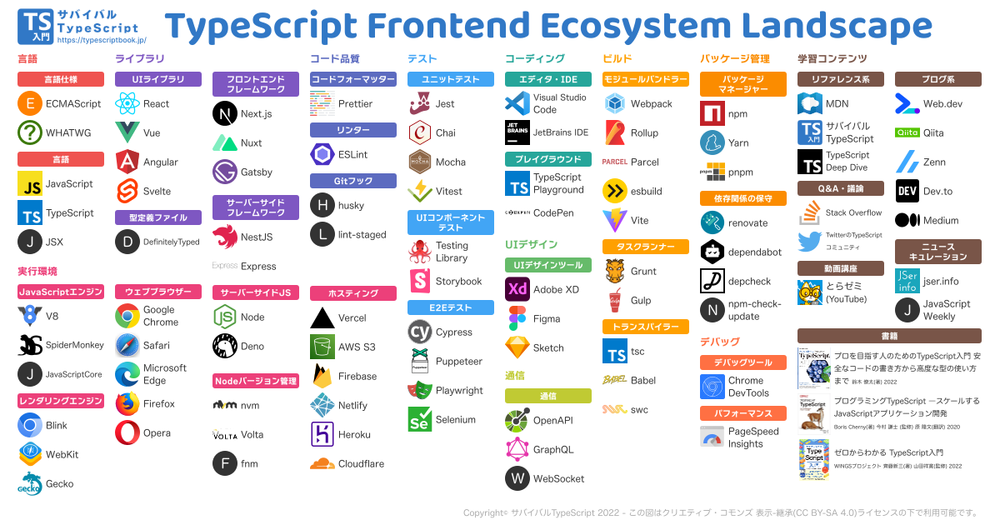

# TypeScript


【学習に良さそうなサイト】

- [サバイバル TypeScript](https://typescriptbook.jp/)
- [TypeScript Deep Dive](https://typescript-jp.gitbook.io/deep-dive/getting-started)
- [type-challenges](https://github.com/type-challenges/type-challenges)

<br />
<br />

TypeScript は、Microsoft により 2012 年 10 月 1 日に初めて発表された、スケーラブルな JavaScript の上位互換言語。

<br>

動的型付け（実行時に型付け）言語である JavaScript に比べ `TypeScript は静的型付け（コンパイル時に型付け）`なため型安全に開発ができる。<br>

現状のプロダクトで JavaScript のライブラリやフレームワークで開発する場合は、TypeScript 化しない方が珍しいくらい。

<br>
TypeScriptで書かれたコードは純粋なJavaScriptにコンパイルされ、ブラウザ、サーバーなどJavaScriptが実行できるすべての実行環境で動作します。<br>
さらに、オープンソースプロジェクトであり、Apache License 2.0で提供されています。

<br />
<br />

---

## **<font color="#00ff00">TypeScript を取り巻くエコシステム</font>**



※[上記画像はサバイバル TypeScript ](https://typescriptbook.jp/overview/ecosystem)を参照
<br />
<br />

---

## **<font color="#00ff00">型付けファイルをインストールしないといけないか判断する基準</font>**

ライブラリをインストールした際に型情報がないライブラリ？の場合は以下のコマンドで型情報だけを追加でダウンロードしないといけない。

```bash:型情報をダウンロード
npm i @types/ライブラリ名
```

追加でダウンロードが必要ない場合の基準

- GitHub のリポジトリのルートディレクトリに<font color="orange">index.d.ts</font>のファイルがある
- package.json の`typings`に上記の<font color="orange">index.d.ts</font>の記述がある

※上記の 2 つに当てはまればデフォルトで型情報を持っている

<br />
<br />

---

## **<font color="#00ff00">型の抽出</font>**

型を使い回す際に不必要な型を除去して必要なものだけ抽出する方法

<br />
<br />

## **【Pick】**

`Pick<Type, Keys>`

Pick は特定の型から一部のプロパティを抽出し、新しい型を作成する。<br>
これは特定のオブジェクトから部分的なオブジェクトを作り出すことが可能。

Pick の例） 以下のような`Person型`があるとして

```ts: Pickの例
type Person = {
    name: string;
    age: number;
    address: string;
};
```

ここから `name` と `age` だけを抽出したい場合、`Pick` を使用する：

```ts: Pickの例
type PartialPerson = Pick<Person, 'name' | 'age'>;

// PartialPersonは以下のようになります:
// {
//     name: string;
//     age: number;
// }
```

<br />
<br />

## **【Omit】**

`Omit<Type, Keys>`

Omit は Pick の反対の動作をする。<br>
指定したプロパティを型から除外し、新しい型を作成する。

Omit の例） 先ほどの`Person型`から`address`を除いた新しい型を作りたい場合

```ts: Omitの例
type PartialPerson = Omit<Person, 'address'>;

// PartialPersonは以下のようになります:
// {
//     name: string;
//     age: number;
// }
```
