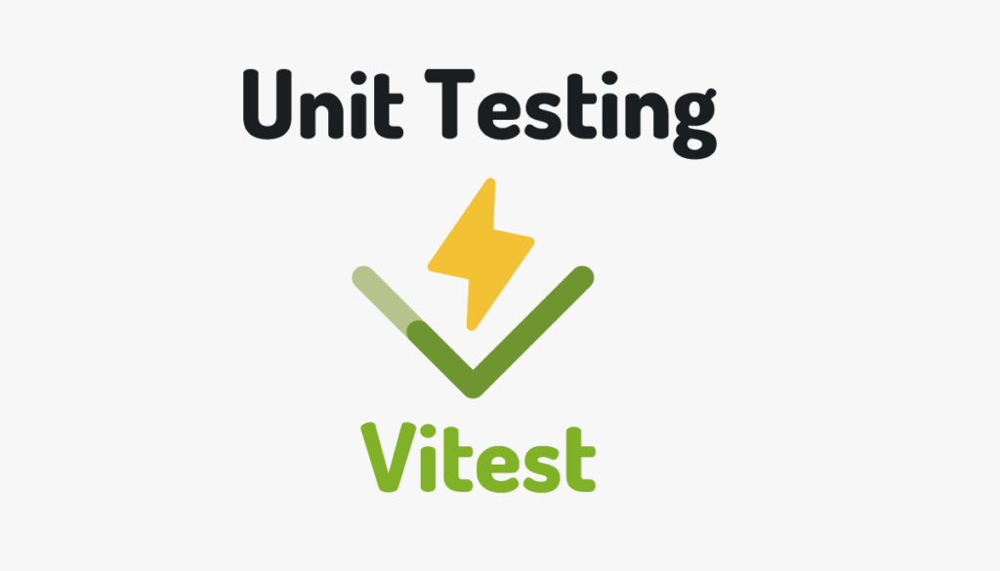

# テストについて

テストコードを書くことで安全な開発が行える

Javascript の一般的なテストフレームワークは Jest?

※[サバイバル TypeScript に Jest の例があった](https://typescriptbook.jp/tutorials/jest)

**【メリット】**

1.  バグの早期発見

        テストコードを書くことにより、コードの挙動を確認し、バグを早期に発見できます。例えば、特定の入力に対する関数の出力を検証することで、予期しない挙動を検出できます。

    <br/>
    <br/>

2.  リファクタリングの容易さ

        テストコードがあると、コードのリファクタリングが安全に行えます。既存のテストがパスする限り、機能が保持されていると確認できます。

    <br/>
    <br/>

3.  コードの品質向上

        Jest は TypeScript をサポートしているため、静的型チェックと単体テストによりコードの品質が向上します。また、Vue3 の Composition API をテストすることで、リアクティブなデータの流れを理解しやすくなります。

    <br/>
    <br/>

4.  ドキュメンテーション

        テストコードはソフトウェアのドキュメンテーションとしても機能します。新たにプロジェクトに参加した開発者がテストコードを読むことで、各関数がどのように動作するかを理解するのに役立ちます。

    <br/>
    <br/>

**【デメリット】**

1.  開発時間の増加

        テストコードを書くためには、その分の時間が必要になります。短期的には開発速度が低下する可能性があります。

   <br/>
   <br/>

2.  適切なテスト設計の難易度

         テストコードを書く際には、どの部分をテストするか、どのようにテストするかといったテスト設計についても深く考える必要があります。これは容易な作業ではなく、特に経験やスキルがない場合は難しいかもしれません。

    <br/>
    <br/>

3.  テストの保守コスト

         コードベースが進化するにつれて、テストコードもそれに追従して更新する必要があります。テストが古くなったり、関連性を失ったりした場合にはそれらを削除または更新する必要があります。

    <br/>
    <br/>

4.  フレームワークやライブラリの変更に対する脆弱性

         Jest や Vue3 などのフレームワークやライブラリが更新されたとき、互換性の問題が生じる可能性があります。これによりテストコードの修正が必要になる場合があります。

    <br/>
    <br/>

メリット・デメリットを考慮に入れてプロジェクトにおけるテストコードの<font color="Red">利点</font>と<font color="Red">コスト</font>をバランスよく評価することが大事

<br>
<br>

# **<font color="#00ff00">Vitest</font>**



[公式リファレンス](https://vitest.dev/api/)

Vitest は、Vite ベースのテスティングフレームワークです[^1]。

Vitest は、公式で「Blazing Fast Unit Test Framework」と謳われています[^1]。つまり、とても高速なユニットテストフレームワークです。

Vitest には、いくつかの特徴があります。Vite の config、transformers、resolvers と plugins をアプリと同じ設定で使用できます。また、Vite の HMR のような watch モードがあり、Vue、React、Svelte、Lit などのコンポーネントテストをサポートしています。さらに、TypeScript や JSX がサポートされており、ESM ファーストで top level await が可能です[^1]。

Jest との関係性については、Jest は JavaScript、TypeScript におけるテストツールとして成熟したツールですが、Vite 環境においては Vitest の方が使い勝手が良く積極的に利用を始めても良いとされています[^1]。また、Vitest は Jest 互換のスナップショットを持ちます[^1]。

以上が私の知っている情報です。他に何か知りたいことはありますか？

[^1]: https://qiita.com/KokiSakano/items/f23e979004f72d70165e.

**【その他記事】**

[Vitest と呼ばれるテスティングフレームワークがめちゃくちゃ....](https://azukiazusa.dev/blog/testingframework-vitest/.)

[【Vitest】絶賛開発中の Vitest を使ってみる - Qiita.](https://qiita.com/tak001/items/3491758d95bfee2c65bc.)

[Vitest を使って Unit Testing にチャレンジ(Vue, React, Svelte).](https://reffect.co.jp/html/vitest.)

[あたらしいテストフレームワーク Vitest を React で試してみた ....](https://dev.classmethod.jp/articles/intro-vitest/.)

**【使用例】**

以下のような商品の税込みの値を算出する関数をテストする場合

<font color="orange">UnitPriceUtils.ts</font>

```ts: テスト対象のコード
/**
 * 特定の税区分に基づいて税抜きの商品価格を計算します。
 * @param {string} category - 商品の税区分
 * @param {number} basePrice - 商品の基本価格
 * @param {number | null | undefined} normalRate - 通常の税率
 * @param {number | null | undefined} reducedRate - 軽減税率
 * @param {string} screen - エラー識別用の画面名
 * @returns {number} 計算された税込の商品価格
 */
export const calculateTaxExcludedPrice = async (
  category: string,
  basePrice: number,
  normalRate: number | null | undefined,
  reducedRate: number | null | undefined,
  screen: string
): Promise<number> => {

  let permilleRate: number

  switch (category) {
    /* 税区分 === "通常" */
    case TaxationCategory.Regular:
      if (!normalRate) {
        throw new Error(`【${screen}】通常の税率を取得できません`)
      }

      permilleRate = normalRate * 10
      return Math.floor((basePrice * (1000 + permilleRate)) / 1000)
    /* 税区分 === "軽減税率" */
    case TaxationCategory.ReducedTaxRate:
      if (!reducedRate) {
        throw new Error(`【${screen}】軽減税率を取得できません`)
      }
      permilleRate = reducedRate * 10
      return Math.floor((basePrice * (1000 + permilleRate)) / 1000)
    default:
      throw new Error(`【${screen}】税区分が不明です`)
  }
}
```

以下のようなテストコードになる

<font color="orange">UnitPriceUtils.test.ts</font>

```ts: vitestのテストコード例
import { describe, expect, test } from 'vitest'
import { calculateTaxExcludedPrice } from './UnitPriceUtils'
import { TaxationCategory } from '../helper/const'

describe('calculateTaxExcludedPrice function', () => {
  test('通常商品の場合、正しく計算されるべき', async () => {
    const result = await calculateTaxExcludedPrice(
      TaxationCategory.Regular,
      1000,
      8,
      null,
      'テスト画面'
    )
    expect(result).toEqual(1080)
  })

  test('通常商品で税率がnullの場合、エラーをスローするべき', async () => {
    expect(
      await calculateTaxExcludedPrice(
        TaxationCategory.Regular,
        1000,
        null,
        null,
        'テスト画面'
      )
    ).rejects.toThrow('通常の税率を取得できません')
  })

  test('軽減税率商品の場合、正しく計算されるべき', async () => {
    const result = await calculateTaxExcludedPrice(
      TaxationCategory.ReducedTaxRate,
      1000,
      null,
      5,
      'テスト画面'
    )
    expect(result).toEqual(1050)
  })

  test('軽減税率商品で税率がnullの場合、エラーをスローするべき', async () => {
    expect(
      await calculateTaxExcludedPrice(
        TaxationCategory.ReducedTaxRate,
        1000,
        null,
        null,
        'テスト画面'
      )
    ).rejects.toThrow('軽減税率を取得できません')
  })

  test('税区分が不明の場合、エラーをスローするべき', async () => {
    expect(
      await calculateTaxExcludedPrice('不明', 1000, 8, 5, 'テスト画面')
    ).rejects.toThrow('税区分が不明です')
  })
})
```

<br>
<br>

## **【it 関数】**

内部でエラーが発生したとき、そのテストを失敗として扱う。<br>
つまり、期待する結果と異なるならエラーを投げ、<br>
期待どおりならエラーを投げないというテストコードを書くことになる。

<br>
<be>

## **【describe 関数】**

describe は第 1 引数に`文字列`、第 2 引数に`関数`を受け取る関数。<br>

describe はテストスイートを定義する。<br>
テストスイートは関連するテストやベンチマーク、または他のネストされたスイートのセットを定義する。<br>
これにより、テストとベンチマークを整理し、レポートをより明確にすることができる。<br>

たとえば、以下のコードでは describe('person', () => {...})が新しいテストスイートを作成し、その中に 3 つのテストケースを含んでいる

```ts: テストコードの例
import { describe, expect, test } from 'vitest'

const person = {
  isActive: true,
  age: 32,
}

describe('person', () => {
  test('person is defined', () => {
    expect(person).toBeDefined()
  })

  test('is active', () => {
    expect(person.isActive).toBeTruthy()
  })

  test('age limit', () => {
    expect(person.age).toBeLessThanOrEqual(32)
  })
})
```

describe ブロックはネストすることも可能で、これによりテストやベンチマークの階層構造を作ることができる。

<br>

**【describe と test の主な違い】**<br>

- describe はテストケースをグループ化し、構造化するために使用される
- test は個々のテストケースを定義するために使用される。

<br>
<br>

## **【test 関数】**

test は個々のテストケースを定義する。<br>
test は一連の関連する期待値(expectations)を定義する。<br>
第 1 引数に`テストの名前`、第 2 引数に`テストを実行するための期待値`を含む関数を受け取ります。

また、オプションで、タイムアウトをミリ秒で指定して、何秒待ってから終了するかを指定できる。<br>
デフォルトは 5 秒で、testTimeout でグローバルに設定できます。

<br>

例えば、以下のテストは、Math.sqrt(4)が 2 であることを期待します

```ts: テストコードの例
import { expect, test } from 'vitest'

test('should work as expected', () => {
  expect(Math.sqrt(4)).toBe(2)
})
```
